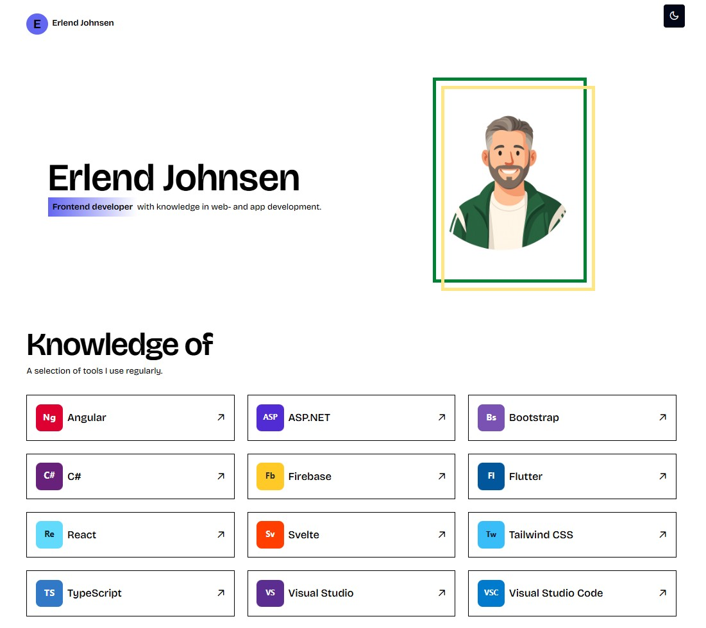

# Erlend Johnsen – Portfolio



An interactive portfolio that highlights my frontend development work, current skillset, and selected school projects from Noroff.

## Description

This single-page application showcases recent coursework projects, provides a quick overview of the technologies I work with, and includes theming support to toggle between light and dark modes.

- Responsive layout tailored for desktop and mobile
- Built-in accessibility and performance optimizations using Angular signals and `NgOptimizedImage`
- Deployed automatically to GitHub Pages on every push to `main`

## Built With

- Angular
- TypeScript
- PrimeNG + Tailwind CSS
- GitHub Pages (static hosting)

## Getting Started

### Installing

Clone the repository and install dependencies:

```bash
git clone git@github.com:johnsulf/portfolio2.git
cd portfolio2
npm ci
```

### Running

Start the development server:

```bash
npm start
```

The app will be available at `http://localhost:4200/`.

## Contributing

Contributions are welcome. Please open an issue to discuss the change first, then submit a pull request from a feature branch. Make sure linting passes with `npm run lint` before requesting review.

## Contact

- [Portfolio](https://johnsulf.github.io/portfolio2/)
- [GitHub](https://github.com/johnsulf)

## License

This project is licensed under the MIT License. See the [LICENSE](LICENSE) file for details.

## Acknowledgments

- Noroff Frontend Development course material for the project briefs
